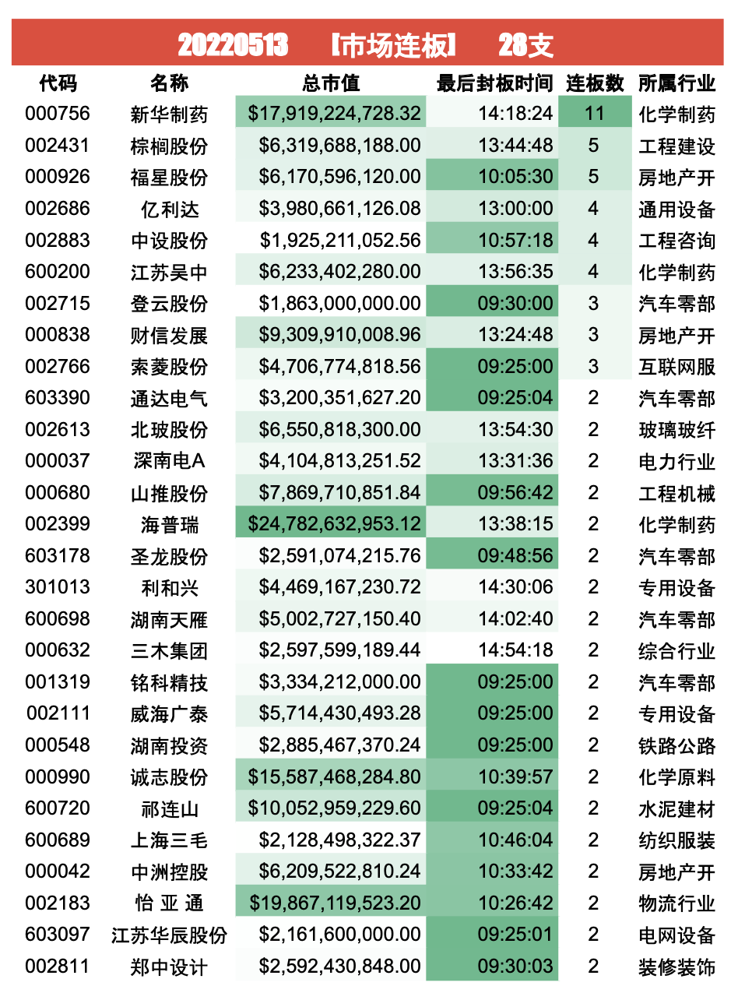
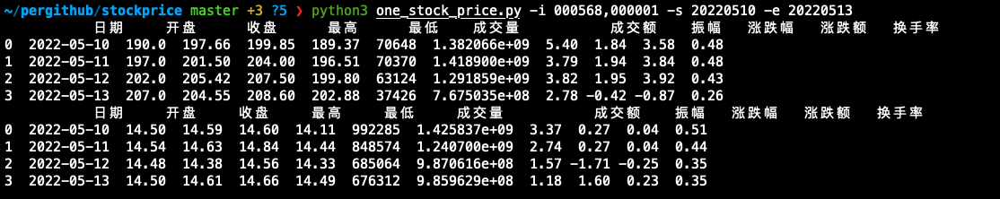
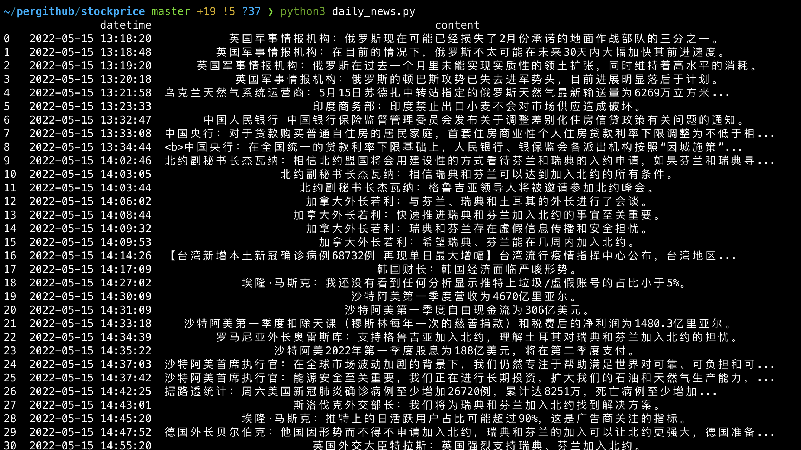

# 用于股票信息收集
## 功能
* 查询每日涨停连板股票
* 查询每日涨停板股票，按照行业分类
* 查询每日涨停金额
* 查询每日涨停后炸板股票
* 查询个股或者多股一段时间内价格
* 查询实时新闻
* 待续...

# 案例

## 每日涨停板 

## 个股查询

## 实时新闻查看

> 功能还在不断完善中...

## reference

https://akshare.xyz/data/stock/stock.html

https://github.com/akfamily/akshare